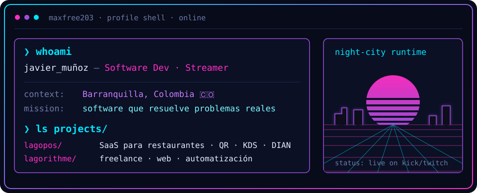

<!-- BANNER ANIMADO (scripts/banner/generate.py) -->
<a href="https://github.com/Maxfree203">
  <picture>
    <source media="(prefers-color-scheme: dark)" srcset="assets/banner-dark.svg">
    <source media="(prefers-color-scheme: light)" srcset="assets/banner-light.svg">
    
  </picture>
</a>

 

---

## `$ whoami`

  

 

## `$ cat tech-stack.yaml`

<table border="1" cellpadding="14" bgcolor="#070b1a">
  <thead>
    <tr>
      <th colspan="2" align="left"><code>maxfree203:~$ cat tech-stack.yaml</code></th>
    </tr>
  </thead>
  <tbody>
    <tr>
      <td width="50%" valign="top"><code>├─ ⚡ backend_apis:</code>  
         
        <code>Python · FastAPI</code>
      </td>
      <td width="50%" valign="top"><code>├─ ▣ databases:</code>  
         
        <code>PostgreSQL · MySQL</code>
      </td>
    </tr>
    <tr>
      <td valign="top"><code>├─ ✦ frontend:</code>  
         
        <code>Vue 3 · JavaScript · HTML · CSS</code>
      </td>
      <td valign="top"><code>├─ ☁ cloud_infra:</code>  
         
        <code>AWS Amplify · Linux · Raspberry Pi · WordPress</code>
      </td>
    </tr>
    <tr>
      <td valign="top"><code>├─ ◉ ai_research:</code>  
        
        
         
        <code>PyTorch · Transformers (mT5) · MediaPipe</code>
      </td>
      <td valign="top"><code>╰─ ⌁ tools_integrations:</code>  
         
        <code>Git · GitHub · Discord bots · Microsoft Graph · DIAN/Factus</code>
      </td>
    </tr>
  </tbody>
  <tfoot>
    <tr>
      <td colspan="2"><code>status: shipping&nbsp;&nbsp;·&nbsp;&nbsp;environment: barranquilla-prod</code></td>
    </tr>
  </tfoot>
</table>

---

## `$ scan --signals`

  <picture>
    <source media="(prefers-color-scheme: dark)" srcset="assets/radar-dark.svg">
    <source media="(prefers-color-scheme: light)" srcset="assets/radar-light.svg">
    
  </picture>&nbsp;
  <picture>
    <source media="(prefers-color-scheme: dark)" srcset="assets/radar-langs-dark.svg">
    <source media="(prefers-color-scheme: light)" srcset="assets/radar-langs-light.svg">
    
  </picture>

<code>signals: dev_skill_radar · language_stack_radar · status: online</code>

---

## `$ ls ~/projects`

| proyecto | qué es | stack |
|:--|:--|:--|
| **LagoPos** | SaaS de gestión para restaurantes: reservas, pedidos por QR, domicilios, KDS y facturación electrónica DIAN | `FastAPI` `PostgreSQL` `Vue 3` |
| **Lagorithme** | Mi marca freelance: webs, integraciones y automatización | `Python` `AWS` |
| **Tesis LSC** | Traducción de español a glosas de Lengua de Señas Colombiana con avatar 3D | `mT5` `MediaPipe` |

---

<!-- SOCIALS -->
## `$ connect --socials`

&nbsp;&nbsp;
&nbsp;&nbsp;

 
 

Hecho con 💜 y mucho tinto desde Barranquilla, Colombia · @Maxfree203

